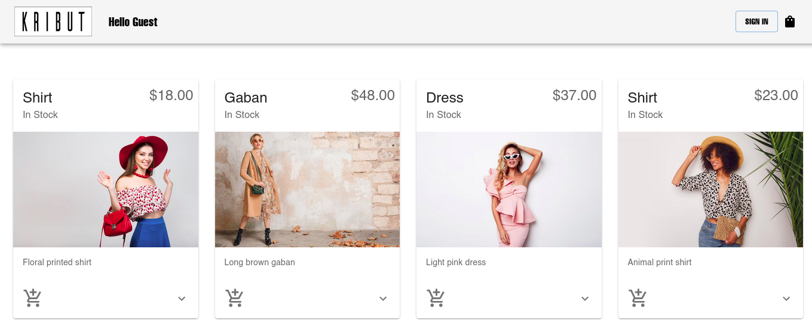

# Kribut - e-commerce-react

This project was bootstrapped with [Create React App](https://github.com/facebook/create-react-app).

## Build a web app in JavaScript + React

I have the pleasure to introduce you my new web project Kribut, it is a virtual e-commerce store specialized in fashion where women's clothing is sold, it is a website with a fresh face and a simple but very attractive and intuitive design, it is also a functional and easy to navigate site, offering a good user experience.

Although the store has a structure necessary to make use of it, it is exposed to changes and updates in the future in order to improve its content and information and add more features to add value to the site and deliver a better user experience. 

## Tech Stack

## Project Description 

This is a mostly Frontend project, made with the React library and JavaScript, we also made use of the Liberian ui material to import the different predefined components of this library which facilitates the development and saves time, we just made some small modifications in terms of design to be similar to the design that we had in mind.
For user authentication Firebase was used, which allows the user to create a new account and log in when it has already been created.
The project is fully responsive for mobile devices.

## Usage

* 1. Clone this repository: 
`git clone https://github.com/alejandrouran/e-commerce-react.git`

* 2. Install required dependencies: 
`npm install`
* 3. Start the srver: 
`npm start`

## About Myself

I am a software developer with a passion for technology and an insatiable curiosity for understanding how things work from the inside.

My experience spans a wide range of technologies, including HTML, CSS, Python, C, JavaScript, React, Django, Flask, Bootstrap, MySQL, MongoDB, Git, Sass, linux and terminal commands. 

I'm always excited to keep learning and discovering new tools and technologies. I love collaborating on challenging projects and finding innovative solutions to problems. Programming for me is more than a job, it's an art form that allows me to bring ideas to life and create impactful digital experiences.

## Bugs
No known bugs at this time. 

## Author

Alejanro Urán

